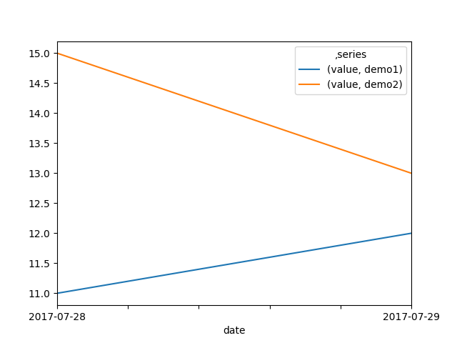
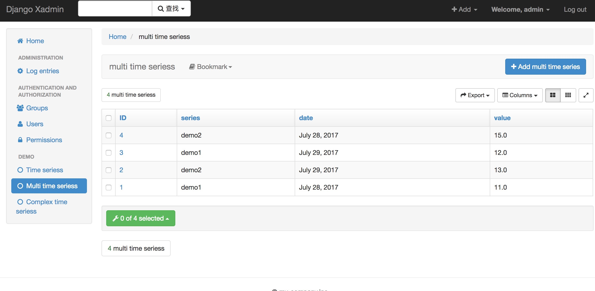

# django pandas 示例项目

本项目使用 django, djangorestframework, pandas 开发。

图示模板部分，使用 https://wq.io/1.0/docs/

# 图示效果

数据图示：

管理后台：

# 项目依赖

> pip install -r requirements.txt

# 本地启动

> python manage.py runserver 0.0.0.0:8000

# 进入管理后台

> xadmin 管理后台：http://127.0.0.1:8000/xadmin/
>
> django管理后台： http://127.0.0.1:8000/admin/

用户名/密码： admin/ demo777777

# demo地址

> http://127.0.0.1:8000/demo/nomodel
>
> http://127.0.0.1:8000/demo/timeseries
>
> http://127.0.0.1:8000/demo/multitimeseries
>
> http://127.0.0.1:8000/demo/multiscatter
>
> http://127.0.0.1:8000/demo/multiboxplot
>
> http://127.0.0.1:8000/demo/complextimeseries
>
> http://127.0.0.1:8000/demo/complexscatter
>
> http://127.0.0.1:8000/demo/complexboxplot
>

